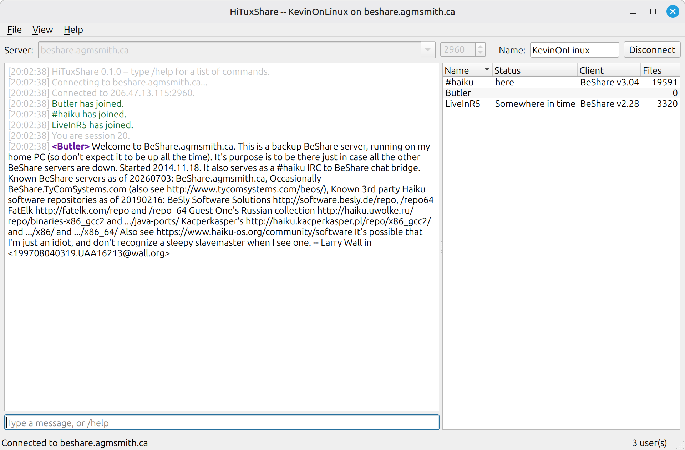
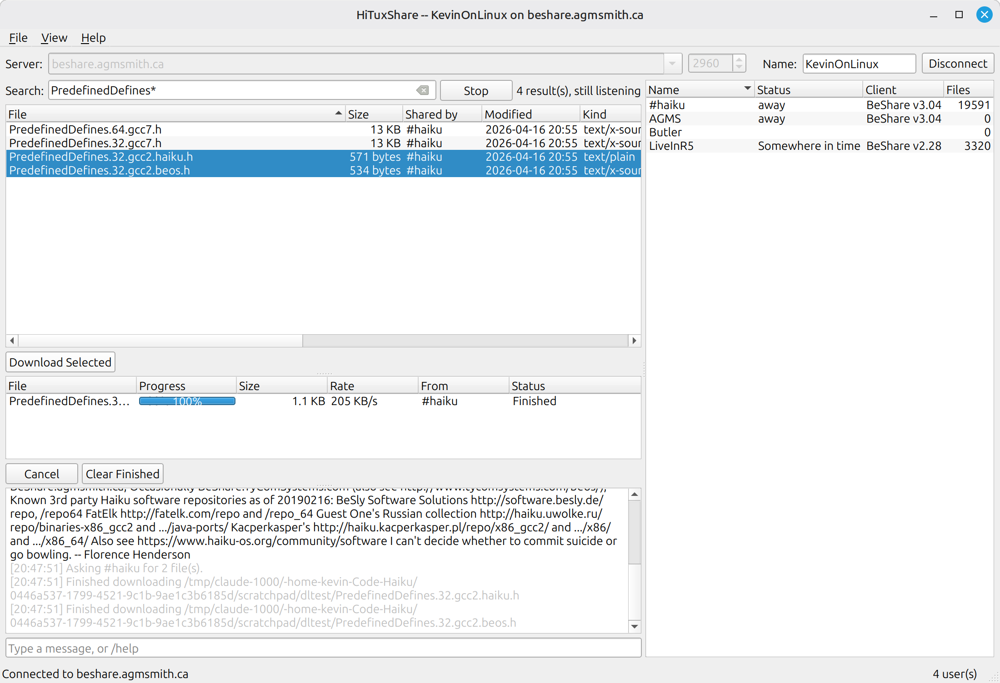
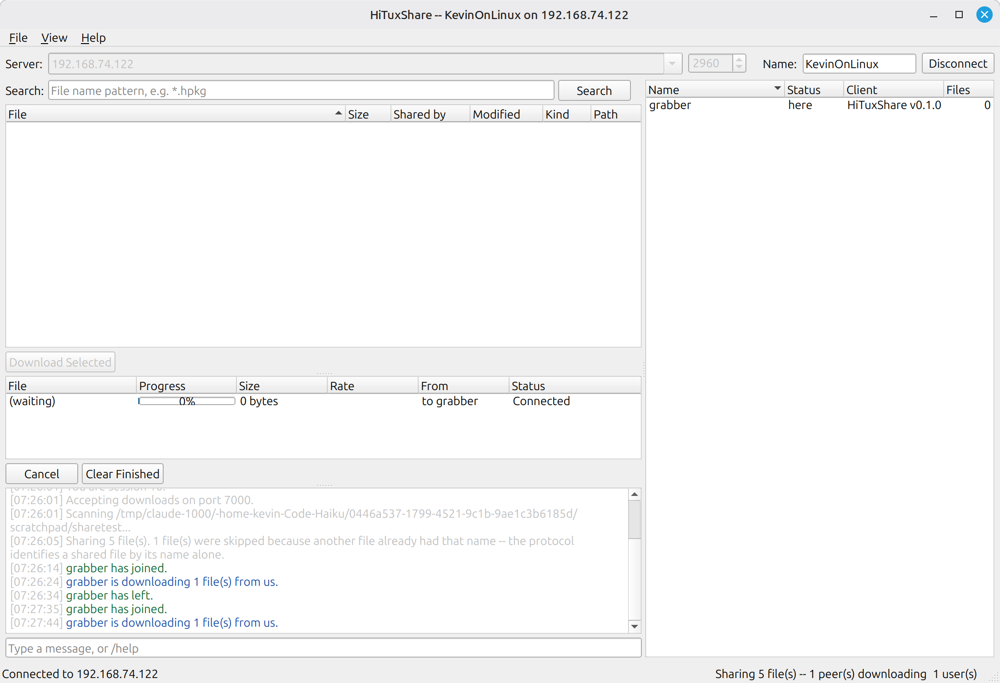

<p align="center">
  
</p>

# HiTuxShare

A native Linux port of [HiShare](https://github.com/atomozero/HiShare) — itself the
modernized edition of Jeremy Friesner's BeShare — speaking the same
[MUSCLE](https://github.com/jfriesne/muscle) protocol, so it joins the same chats, user lists and file queries as the Haiku clients.



<sub>Connected to <code>beshare.agmsmith.ca</code> alongside real Haiku/BeOS clients —
#haiku on BeShare 3.04 sharing 19,591 files, and LiveInR5 on BeShare 2.28.</sub>

## Status

**Phases 1 to 3 are working** — chat, live file search, downloads, and sharing
your own files for other people to download. Verified against both a private
`muscled` and the live public network, including real files pulled from a Haiku
peer running BeShare 3.04.

| Phase | State |
|---|---|
| 0 — Protocol proof (`hitux-probe`) | **Done** |
| 1 — Chat | **Working**; private-message tabs and `/ignore` still to come |
| 2 — Downloading | **Working**; resume and connect-back still to come |
| 3 — Sharing | **Working**; live folder watching and NAT traversal still to come |
| 4 — Polish, i18n, packaging | Not started |

What works today: connect and reconnect, a remembered server dropdown, live user
list with status / client / file-count columns, public chat, `/me` actions, private
messages, ping with round-trip timing, nickname changes, input history, nickname
tab-completion, timestamps, light and dark themes, and persistent settings including
window and splitter geometry.

**File search** is a live subscription rather than a snapshot: matches keep arriving
as other people share things, with nothing to refresh. **Downloads** go peer to peer
and never through the server; selecting several files from one person uses a single
connection rather than several, chunk checksums are verified, and names that peers
choose are sanitised before they go anywhere near the filesystem.



**Sharing** publishes a folder you choose and serves it to peers directly. The scan
runs on a background thread, so a folder with thousands of files does not freeze the
window, and one connection carries however many files a peer asked for.

Note that the protocol identifies a shared file by its **name alone**, with the
directory carried separately — so the same file name in two sub-folders is one entry
as far as the network is concerned. HiTuxShare keeps the first and tells you how many
it skipped rather than silently publishing an arbitrary one.



Not yet implemented, and not pretended otherwise: resuming an interrupted download,
transferring with a firewalled peer (that needs connect-back), byte-range requests,
bandwidth limiting, NAT traversal (UPnP/NAT-PMP), and watching the share folder for
changes while running — the scan happens when you connect.

## Build

Needs a C++17 compiler, CMake 3.16+, and Qt 6 Widgets development packages.

```sh
git clone --recursive https://github.com/KevinAdams05/HiTuxShare.git
cd HiTuxShare
cmake -S . -B build -DCMAKE_BUILD_TYPE=Release
cmake --build build -j"$(nproc)"
```

If you cloned without `--recursive`:

```sh
git submodule update --init --recursive
```

MUSCLE is vendored under `third_party/muscle`, pinned to the `v9.92` tag and built
unmodified. Nothing else is downloaded at build time.

Useful options: `-DHITUX_BUILD_GUI=OFF` to build only the headless probe (no Qt
needed), `-DHITUX_BUILD_PROBE=OFF` to skip it.

## Run

```sh
build/qt/hitux                                        # the GUI
build/tools/probe/hitux-probe <server> [nick] [port]  # headless, for testing
```

Settings live in `$XDG_CONFIG_HOME/hituxshare/settings.msg`
(`~/.config/hituxshare/settings.msg`), including the remembered server list, which
orders itself by what you actually connect to.

`cmake --install build --prefix ~/.local` puts the binary, the `.desktop` entry and
the icon theme files where a desktop environment will find them.

## Documentation

| | |
|---|---|
| [`PLAN.md`](PLAN.md) | The port analysis: language and toolkit options with trade-offs, per-file port cost, phase breakdown, risks |
| [`docs/PROTOCOL.md`](docs/PROTOCOL.md) | BeShare-over-MUSCLE wire reference, distilled from the HiShare and MUSCLE sources |
| [`docs/TESTING.md`](docs/TESTING.md) | How to test against a private server, and the traps that make working code look broken |
| [`docs/STYLE.md`](docs/STYLE.md) | Coding style, and the rules that are not about formatting |

### Diagrams

| | |
|---|---|
| [`architecture.svg`](docs/diagrams/architecture.svg) | Layered design — toolkit-free core, MUSCLE below, front-ends above |
| [`protocol-flow.svg`](docs/diagrams/protocol-flow.svg) | What each phase puts on the wire |
| [`porting-seams.svg`](docs/diagrams/porting-seams.svg) | Every BeAPI dependency and its Linux replacement |
| [`roadmap.svg`](docs/diagrams/roadmap.svg) | Phases 0–4 with completion criteria |

## Design in one paragraph

`libhitux-core` holds all the protocol and network logic and **never includes a Qt
header**. It reaches the GUI thread through MUSCLE's `ICallbackMechanism`, which the
front-end supplies — `QPostEventCallbackMechanism` for the GUI, `SocketCallbackMechanism`
for the headless probe. That single seam is what keeps a future FLTK or TUI front-end
possible, keeps the core testable with no display, and means the Qt code can touch
widgets from a listener callback without any locking.

## Licence

MIT — see [LICENSE](LICENSE). BeShare and HiShare were both released into the public
domain by their authors; MUSCLE is under its own permissive Meyer Sound licence.
